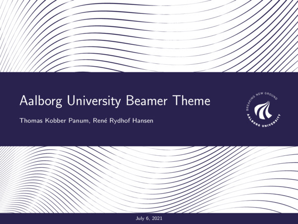
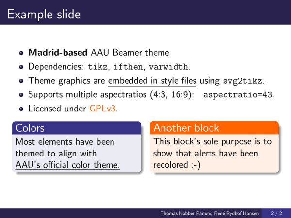

# Aalborg University Beamer Theme
This theme is **not** an offical theme endorsed by Aalborg University.
The initial design was established by [René Rydhof Hansen](http://people.cs.aau.dk/~rrh/).
[Thomas Kobber Panum](https://github.com/tpanum) have then further modified it and provided a unique frontpage layout.

## Design
The theme is based on the famous [Madrid beamer theme](https://deic-web.uab.cat/~iblanes/beamer_gallery/individual/Madrid-default-default.html), with the following modifications:

- Simplified footer to provide less clutter.
- Colors are modified to align with the official AAU color guidelines.
- Frontpage design have been completely revamped to provide a more modern look and feel that reflect the design language of AAU.
- Graphics (waves and logo) are directly embedded into the style files.

## Gallery

The shown slides are based on the [example.tex file](example.tex).

## Installation
1. Visit the [releases page](https://github.com/tpanum/aau-beamer-template/releases).
2. Download the most recent version
3. Extract the style files (`*.sty`) into the directory of your beamer presentation.
4. Then simply just add `\usetheme{Aalborg}` in your beamer presentation file.
5. Ensure that the packages `tikz`, `ifthen`, and `varwidth` are available in your TeX installation.

*If this still remain confusing, take a look at the [example.tex file](example.tex).*

## Related work
- [Jesper Kjær Nielsen's AAU Beamer theme](https://github.com/jkjaer/aauLatexTemplates)

## Contributions
I am no longer employed at Aalborg University, so I do not expect frequent updates.
However, pull requests are more than welcome.
